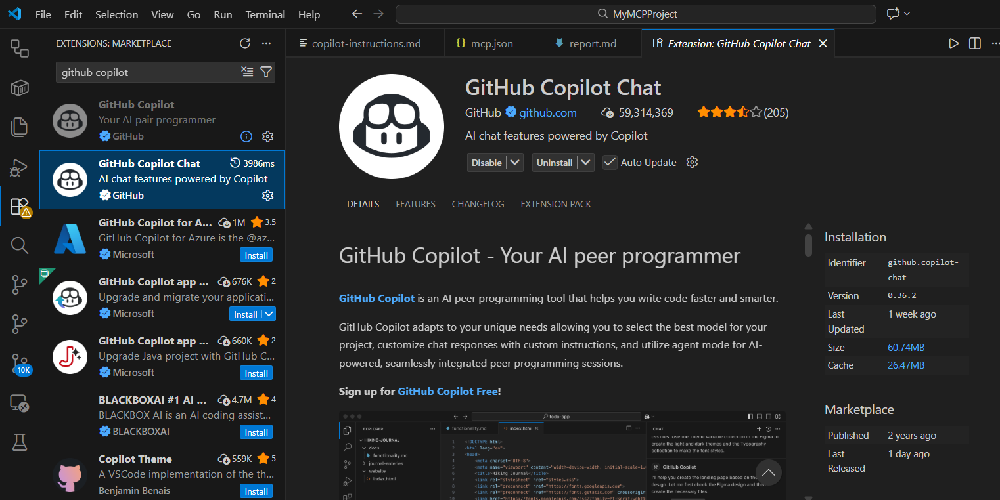

# My MCP Setup Report

## 1. What I Did
- Set up VS Code with GitHub Copilot and Copilot Chat extensions.
- Created .github/copilot-instructions.md for rules.
- Added .vscode/mcp.json with the Tenx MCP server details (URL: https://mcppulse.10academy.org/proxy, headers for my device).
- Started the MCP server and authorized with GitHub.
- Researched Boris Cherny's workflow on X and added rules like "think step-by-step", "explain changes", "keep code clean".

## 2. What Worked
- MCP connected successfully after auth.
- Agent followed my rules better (e.g., explained steps instead of rushing).

  <!-- add this screenshot if you have it -->

## 3. What Didn't Work
- First time, no "Add Server" button showed — fixed by reloading VS Code window (Ctrl+R) and double-checking folder names.
- One rule was ignored until I made it clearer and shorter.

## 4. Insights Gained
- Good rules guide the AI like instructions to a helper — "step-by-step" reduced mistakes.
- Testing rules in real chats shows what actually changes behavior.
- Learned how MCP logs everything quietly in background.

## Other Artifacts
- Final rules file: [copilot-instructions.md](./copilot-instructions.md)
